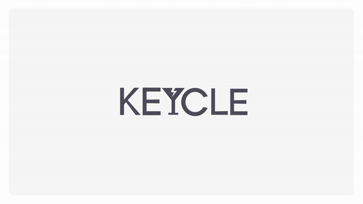

# KEYCLE

> 🔗 Notion: [KEYCLE](https://fast-colony-5b0.notion.site/KEYCLE-d4a1c4016c1146e2be2dfbf3459df359?pvs=4)

 

# 프로젝트 소개

> KeepCycle, KEYCLE!  
>
> ♻️ KEYCLE은 분리배출 퀴즈와 사진 촬영 두 가지 기능을 결합한 프로젝트 입니다.
> 환경 보호에 대한 인식을 높이고, 사진으로 즐거운 기억을 남길 수 있는 서비스를 제공합니다.
>
> ✅ 분리배출 퀴즈
>
> - 퀴즈를 통해 사용자들이 분리배출에 대한 지식을 향상시키고, 환경 보호에 대한 경각심을 높이기 위해 설계되었습니다.
> - 사용자는 퀴즈를 풀면서 분리배출 질문에 대한 해답을 통해 새로운 환경 지식을 학습할 수 있습니다.
> - 오답률을 통해 틀린 부분을 파악하고, 다른 사용자들과 비교해 볼 수 있습니다.
>
> ✅ 프레임 카메라
>
> - 사용자가 카메라를 통해 사진을 찍을 때 두 가지 프레임 중 선택하여 사진을 꾸밀 수 있도록 합니다.
> - 사용자는 사진을 QR 코드로 전송받아 다운로드하여 저장할 수 있습니다.
>
> ---
>
> 🧑🏻‍💻 Frontend 박도겸 | Backend 김가언 | Backend 김혜림 | 👩🏻‍🎨 Design by 최재정

 

 

# 프로젝트 기간

_🗓️ 2024. 02. 14 ~ 2024. 02. 24_

 

 

# KEYCLE 전시 소개 영상

 

 

# 트러블 슈팅

- [Response JSON 파싱 에러](https://fast-colony-5b0.notion.site/JSON-c57bd7bac01846e0a34526d79c8ee210?pvs=4)
- [s3 키 파일 관련 오류](https://fast-colony-5b0.notion.site/s3-2882589d603f4ee8a8263a740e026a8a?pvs=4)
- [카메라 권한 에러](https://fast-colony-5b0.notion.site/a765925b721c452aaabe4f3b54bfed1e?pvs=4)
- [managy.py runserver 실행 에러](https://fast-colony-5b0.notion.site/managy-py-runserver-a50e055c4767467db62d1593e5324d45?pvs=4)
